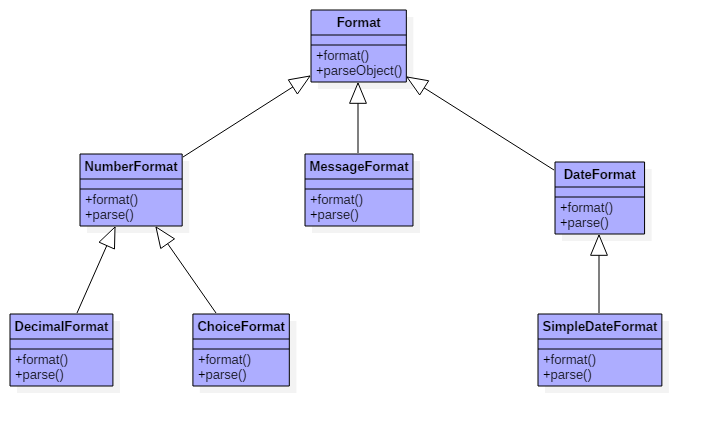

## MessageFormate 格式如下：
 格式： ArgumentIndex[,FormatType[,FormatStyle]]
* ArgumentIndex ，是从0开始的入参位置索引。
* FormatType ，指定使用不同的Format子类对入参进行格式化处理。值范围如下：
	number：调用NumberFormat进行格式化
	date：调用DateFormat进行格式化
	time：调用DateFormat进行格式化
	choice：调用ChoiceFormat进行格式化
* FormatStyle ，设置FormatType中使用的格式化样式。值范围如下：
short，medium，long，full，integer，currency，percent，SubformPattern(子格式模式，形如#.##)
注意： FormatType 和 FormatStyle 主要用于对日期时间、数字、百分比等进行格式化。

示例——将数字1.23格式为1.2：
```java
double num = 1.23; String str =
MessageFormat.format("{0,number,#.#}", num);
```

## MessageFormat注意点
1. 两个单引号才表示一个单引号，仅写一个单引号将被忽略。
2. 单引号会使其后面的占位符均失效，导致直接输出占位符。
MessageFormat.format("{0}{1}", 1, 2); // 结果12
MessageFormat.format("'{0}{1}",1, 2); // 结果{0}{1}
MessageFormat.format("'{0}'{1}", 1, 2); // 结果{0}

因此可以用于输出左花括号(单写左花括号会报错，而单写右花括号将正常输出)

MessageFormat.format("'{'{0}}", 2); // 结果{2
因此前言中的示例应该写为
{0}, this is {1}''s cat.{1},this is {0}''s dog.


类层级关系:

1. DecimalFormat
用于格式化十进制实数。通过格式字符串来自定义格式化类型，舍入方式为half-even(四舍五入)。
格式化模式： 正数子模式;负数子模式 ，如 0.00;-0.00 ，简写为 0.00 。
模式中的占位符：
* 0 代表该为位为数字，若不存在则用0填充
* # 代表该为位为数字
* , 代表分隔符, 如模式为 #,# ，那么格式化10时会返回1,0

2. ChoiceFormat
相当于以数字为键，字符串为值的键值对。分别使用一组double类型的数组作为键，一组String类型的数组作为值，两数组相同索引值的元素作为一对。
注意：当找不到对应的键值对时，则使用第一或最后一对键值对。

## 性能问题　　
 由于静态方法 MessageFormat.format 内部是
```java
public static String format(String pattern, Object ... arguments) {
       MessageFormat temp = new MessageFormat(pattern);
       return temp.format(arguments);
}
```java
 因此若要多次格式同一个模式的字符串，那么创建一个MessageFormat实例在执行格式化操作比较好些。
```java
   String message = "oh, {0} is a hero";  
   MessageFormat messageFormat = new MessageFormat(message);  
   Object[] array = new Object[]{"donald"};  
   String value = messageFormat.format(array);  
   System.out.println(value);  
```
 对于简单的格式化或字符串组装， MessageFormat.format方法 使用更方便些，但要格式化处理更丰富的话要是用 String.format方法 吧！  

 [MessageFormat用法](http://blog.csdn.net/caomiao2006/article/details/51706818)  
 [MessageFormat用法](http://blog.csdn.net/tianzongnihao/article/details/54912306)    
 [JAVA字符串格式化-String.format()的使用](http://blog.csdn.net/lonely_fireworks/article/details/7962171/)
